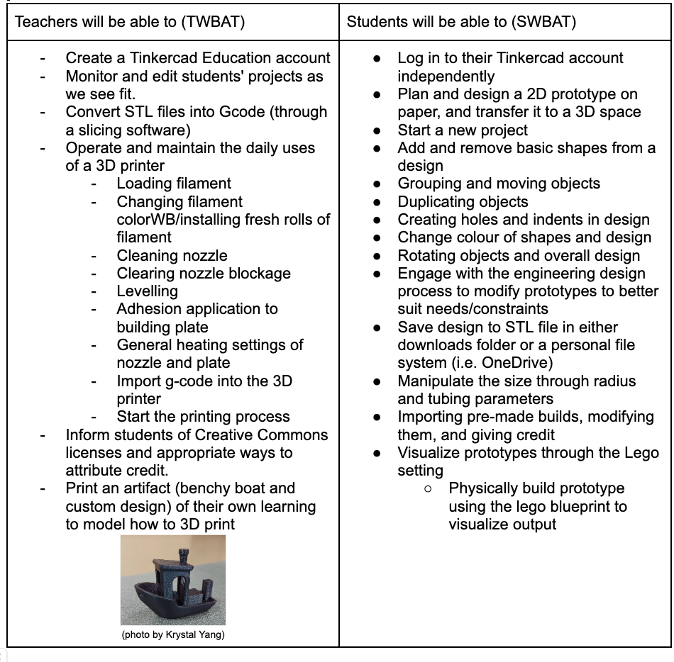

 

# Introduction to 3D Design and Print for Elementary Education
This workshop is intended for educators in Elementary Education (Kindergarten to Grade 5) and focuses on the [British Columbia curriculum](https://curriculum.gov.bc.ca/){:target="_blank"} as well as the [BC Digital Learning Framework](https://www2.gov.bc.ca/assets/gov/education/kindergarten-to-grade-12/teach/teaching-tools/digital-literacy-framework.pdf){:target="_blank"} but can be modified for your specific contexts, frameworks and curriculums. Our goal is to provide accessible Open Educational Ressources to support teachers to intergrate technology such as 3D design and printing into their practice. We also hope to share our expertise, by including our contact information and those of other websites that can act as support during your learning process. These workshops can be done on your own time, but will also be shared during various Professional Development days and conferences. 

## Why 3D printing for Elementary Education 
There are many benefits to 3D printing that can be further found in our research paper. 3D printing meets many of the BC curriculum Core competencies such as critical and reflective thinking. For instance it is important for **"students and teachers to take risks and recognize that I may not immediately be successful" (BC curriculum)**

According to Lee & Kwon (2023), the following are some of the key benefits.
1. 3D models can help create knowledge and emphasizes that we are all able to create and design. Students and teachers can thus use 3D models to show abstract ideas.
2. Students can use STEM skills such as designing, creating and modifying prototypes. Thus they are able to learn from their mistakes and visualize their errors.
3. Students and teachers can communicate their learning using diverse tools. Instead of just speaking, writing and drawing. 3D printing can become more accessible for all to be creators.
4. 3D design and print can be expowering to those with learning diversities. For instance visually impared students may benefit from printing braille and 3D designs, students with learning disabilities could benefit from the 3D world and manipulation and language learners could benefit from printing letters in their own language, which could help support language revitalization.

All in all, 3D printing can thus make learning more inclusive by providing a different means of communication to our learners and giving access to be a creator and designer by using a tool they may later encounteer in their future workplace.
  
## Why TinkerCad? 

[TinkerCad](http://tinkercad.com){:target="_blank"} is a user friendly surface that enables users to create 3 dimensional digital designs, which then can be 3D printed and made into physical objects. TinkerCad is useful for all ages and levels, as its features are user friendly, free to save and use. TinkerCad makes 3D designing more accessible and grants the ability to publish designs under a Creative Commons license. In addition to this workshop, throughout TinkerCad there are numerous tutorials that model a hands-on approach to learning this software. 

## Learning objectives
By the end of this workshop, participants will be able to:

[NEXT STEP: Pre-Workshop Activities](pre-workshop.html){: .btn .btn-blue }
